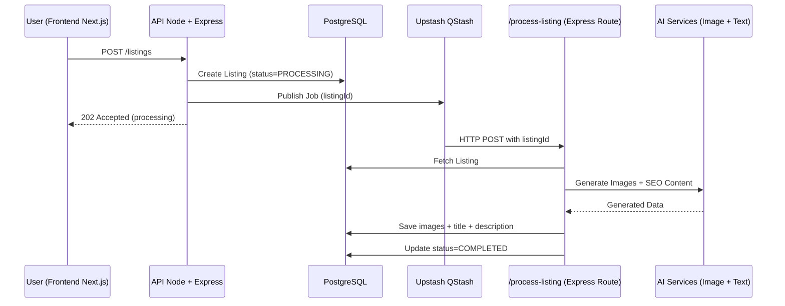

# ANUNCIA.AI API

## 🔄 Listing Generation Flow

### Flow Explanation

1. The frontend sends a request to create a new listing.
2. The API stores the listing with `PROCESSING` status.
3. A background job is published to Upstash QStash.
4. QStash triggers the `/process-listing` route.
5. The API generates AI images and SEO content.
6. The listing is updated to `COMPLETED`.

