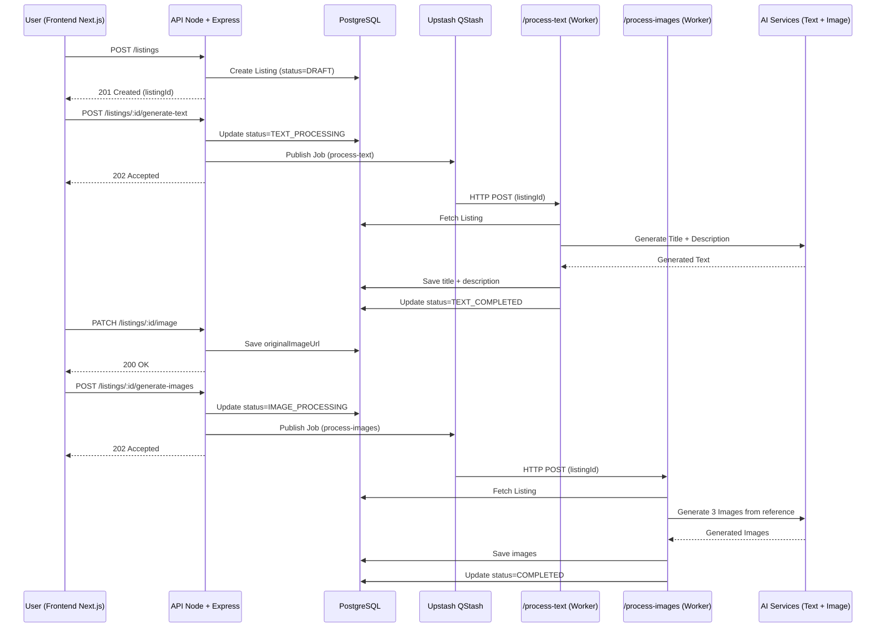

# ANUNCIA.AI API

API em Node.js + Express + Prisma para geração de anúncios de e-commerce assistida por IA. O texto (título, descrição, tags, slug) é gerado via Google Gemini e as imagens de produto são geradas via fal.ai a partir de uma imagem de referência enviada pelo usuário.

---

## ✨ Principais funcionalidades

- Autenticação por e-mail/senha (JWT) e login social via Google OAuth
- Geração de texto de anúncio via Google Gemini
- Geração de imagens de produto via fal.ai (image-to-image)
- Upload e armazenamento de imagens no Cloudflare R2 (S3-compatible)
- Processamento assíncrono via Upstash QStash (workers HTTP)
- Sistema de planos e assinaturas com consumo de tokens por geração

---

## 🧰 Stack

- **Runtime / Linguagem:** Node.js + TypeScript (ES2024)
- **Web:** Express 5
- **Banco de dados:** PostgreSQL (via Prisma ORM)
- **Validação:** Zod
- **Testes:** Vitest
- **Fila de jobs:** Upstash QStash
- **Storage:** Cloudflare R2 (via AWS S3 SDK)
- **IA:** Google Gemini (texto) e fal.ai (imagens)
- **Auth:** JSON Web Token + Google Auth Library

---

## 🏛️ Arquitetura

O projeto segue **Clean Architecture / DDD**, com separação estrita entre camadas — as dependências sempre apontam para dentro.

```
src/
├── core/           Primitivas compartilhadas (Either monad, entidades base, adapters)
├── domain/         Regras de negócio
│   ├── enterprise/   Entidades, mappers e eventos
│   └── application/  Casos de uso, contratos de repositório, queue e storage
└── infra/          Implementações concretas
    ├── http/         Express, rotas, controllers, factories, middlewares
    ├── prisma/       Cliente Prisma e implementações de repositório
    ├── ai/           Integrações com Gemini e fal.ai
    ├── storage/      Cliente Cloudflare R2
    ├── qstash/       Cliente e serviço de fila
    ├── google/       Cliente Google OAuth
    └── env.ts        Schema Zod das variáveis de ambiente
```

### Padrões-chave

- **Either monad** — todo caso de uso retorna `Either<Error, Response>`. Falhas viram `left(...)`, sucessos viram `right(...)`. Controllers traduzem isso para o status HTTP. Casos de uso nunca lançam exceções.
- **Factories para DI manual** — não há container de IoC. Cada controller é montado em `src/infra/http/factories/make-*.ts`, instanciando repositórios concretos e injetando-os no caso de uso.
- **Repository pattern** — a camada de domínio só conhece a interface do repositório. Testes usam implementações in-memory de `test/repositories/`.
- **Workers de fila** — a própria API expõe rotas que recebem os jobs publicados pela QStash. Essas rotas são intencionalmente não autenticadas via JWT (a QStash assina cada requisição e a validação é feita por chave de assinatura).

---

## 🔄 Fluxo de geração de anúncio

O ciclo de vida de um anúncio é controlado pelo enum `StatusEnum`:

```
DRAFT → TEXT_PROCESSING → TEXT_COMPLETED → IMAGE_PROCESSING → IMAGE_COMPLETED → COMPLETED
```

Resumo dos passos:

1. O frontend envia uma requisição para criar um novo anúncio.
2. A API persiste o anúncio com status `DRAFT`.
3. Um job é publicado na Upstash QStash para gerar o texto.
4. A QStash invoca a rota `/process-text`, que gera título e descrição via Gemini e atualiza o status para `TEXT_COMPLETED`.
5. O usuário envia uma imagem de referência (upload para o Cloudflare R2).
6. Outro job é publicado na QStash para gerar as imagens finais.
7. A QStash invoca a rota `/process-images`, que gera as variações via fal.ai e finaliza o anúncio com status `COMPLETED`.


```mermaid
sequenceDiagram
    participant U as User (Frontend Next.js)
    participant API as API Node + Express
    participant DB as PostgreSQL
    participant Q as Upstash QStash
    participant WT as /process-text (Worker)
    participant WI as /process-images (Worker)
    participant AI as AI Services (Text + Image)

    U->>API: POST /listings
    API->>DB: Create Listing (status=DRAFT)
    API-->>U: 201 Created (listingId)

    U->>API: POST /listings/:id/generate-text
    API->>DB: Update status=TEXT_PROCESSING
    API->>Q: Publish Job (process-text)
    API-->>U: 202 Accepted

    Q->>WT: HTTP POST (listingId)
    WT->>DB: Fetch Listing
    WT->>AI: Generate Title + Description
    AI-->>WT: Generated Text
    WT->>DB: Save title + description
    WT->>DB: Update status=TEXT_COMPLETED

    U->>API: PATCH /listings/:id/image
    API->>DB: Save originalImageUrl
    API-->>U: 200 OK

    U->>API: POST /listings/:id/generate-images
    API->>DB: Update status=IMAGE_PROCESSING
    API->>Q: Publish Job (process-images)
    API-->>U: 202 Accepted

    Q->>WI: HTTP POST (listingId)
    WI->>DB: Fetch Listing
    WI->>AI: Generate 3 Images from reference
    AI-->>WI: Generated Images
    WI->>DB: Save images
    WI->>DB: Update status=COMPLETED
```

---

## ✅ Pré-requisitos

Antes de rodar o projeto localmente, você vai precisar de:

- **Node.js 20+** e **npm**
- **Docker** + **Docker Compose** (para subir o Postgres local)
- Credenciais das integrações externas:
  - **Google Cloud Console** — `GOOGLE_CLIENT_ID` para login social
  - **Cloudflare R2** — bucket + chaves de acesso S3-compatible
  - **Upstash QStash** — token e chaves de assinatura
  - **Google AI Studio** — `GEMINI_API_KEY` para geração de texto
  - **fal.ai** — `FAL_KEY` para geração de imagens

> Para desenvolvimento local, a QStash precisa conseguir chamar a sua API. Use uma ferramenta como [ngrok](https://ngrok.com/) ou [Cloudflare Tunnel](https://developers.cloudflare.com/cloudflare-one/connections/connect-networks/) para expor o `localhost:8080` e configure o `API_URL` apontando para a URL pública.

---

## 🚀 Getting Started

### 1. Clonar o repositório

```bash
git clone https://github.com/anunci-ai/anuncia-ai-api.git
cd anuncia-ai-api
```

### 2. Instalar dependências

```bash
npm install
```

### 3. Configurar variáveis de ambiente

Copie o arquivo de exemplo e preencha com suas credenciais:

```bash
cp .env.example .env
```

Veja a seção [Variáveis de ambiente](#-variáveis-de-ambiente) para detalhes de cada chave.

### 4. Subir o banco de dados local

```bash
docker compose up -d
```

Isso sobe um container PostgreSQL em `localhost:5432` com as credenciais já apontadas pelo `DATABASE_URL` padrão do `.env.example` (usuário `docker`, senha `docker`, database `anunciadb`).

### 5. Aplicar as migrations

```bash
npx prisma migrate dev
```

### 6. Popular o banco com dados iniciais (plano demo)

```bash
npm run db:seed
```

### 7. Iniciar o servidor em modo dev

```bash
npm run dev
```

A API ficará disponível em `http://localhost:8080`. Um `GET /` retorna o status do serviço.

---

## 🔐 Variáveis de ambiente

Todas as variáveis são validadas no startup pelo schema Zod em `src/infra/env.ts`. Se algo estiver faltando, a API não sobe.

### Servidor

| Variável   | Obrigatória | Descrição                                                 |
| ---------- | ----------- | --------------------------------------------------------- |
| `NODE_ENV` | Sim         | Ambiente de execução (`development`, `production`).       |
| `PORT`     | Não         | Porta HTTP. Padrão: `8080`.                               |
| `API_URL`  | Sim         | URL pública desta API (usada pela QStash para callbacks). |

### Banco de dados

| Variável       | Obrigatória | Descrição                        |
| -------------- | ----------- | -------------------------------- |
| `DATABASE_URL` | Sim         | String de conexão do PostgreSQL. |

### Autenticação

| Variável         | Obrigatória | Descrição                                |
| ---------------- | ----------- | ---------------------------------------- |
| `JWT_SECRET`     | Sim         | Segredo usado para assinar tokens JWT.   |
| `JWT_EXPIRES_IN` | Sim         | Tempo de expiração do token (ex.: `7d`). |

### Google OAuth

| Variável           | Obrigatória | Descrição                                       |
| ------------------ | ----------- | ----------------------------------------------- |
| `GOOGLE_CLIENT_ID` | Sim         | Client ID OAuth obtido no Google Cloud Console. |

### Cloudflare R2

| Variável                       | Obrigatória | Descrição                                      |
| ------------------------------ | ----------- | ---------------------------------------------- |
| `CLOUDFLARE_ENDPOINT`          | Sim         | URL do endpoint S3 do R2.                      |
| `CLOUDFLARE_ACCESS_KEY_ID`     | Sim         | Access key do bucket.                          |
| `CLOUDFLARE_SECRET_ACCESS_KEY` | Sim         | Secret key do bucket.                          |
| `CLOUDFLARE_BUCKET_NAME`       | Sim         | Nome do bucket.                                |
| `CLOUDFLARE_PUBLIC_URL`        | Sim         | URL pública para servir os arquivos do bucket. |

### Upstash QStash

| Variável                     | Obrigatória | Descrição                                          |
| ---------------------------- | ----------- | -------------------------------------------------- |
| `QSTASH_URL`                 | Sim         | URL da API da QStash.                              |
| `QSTASH_TOKEN`               | Sim         | Token para publicar jobs.                          |
| `QSTASH_CURRENT_SIGNING_KEY` | Sim         | Chave de assinatura atual (validação de webhooks). |
| `QSTASH_NEXT_SIGNING_KEY`    | Sim         | Chave de assinatura para rotação.                  |

### Serviços de IA

| Variável         | Obrigatória | Descrição                                         |
| ---------------- | ----------- | ------------------------------------------------- |
| `GEMINI_API_KEY` | Sim         | Chave de API do Google Gemini (geração de texto). |
| `AI_TEXT_MODEL`  | Sim         | Nome do modelo Gemini (ex.: `gemini-2.0-flash`).  |
| `FAL_KEY`        | Sim         | Chave de API da fal.ai (geração de imagens).      |

---

## 📜 Scripts NPM

| Script                 | O que faz                                                              |
| ---------------------- | ---------------------------------------------------------------------- |
| `npm run dev`          | Sobe o servidor em modo watch com `tsx`.                               |
| `npm test`             | Roda os testes com Vitest em modo watch.                               |
| `npm run db:seed`      | Popula o banco com dados iniciais (plano demo).                        |
| `npm run prepare`      | Instala os hooks do Husky (rodado automaticamente após `npm install`). |
| `npm run vercel-build` | Build para a Vercel: `prisma generate && prisma migrate deploy`.       |

Comandos úteis com Prisma:

```bash
npx prisma migrate dev --name <nome_da_migration>   # cria e aplica uma migration
npx prisma generate                                  # regenera o client Prisma
npx prisma studio                                    # UI para inspecionar o banco
```

---

## 🧪 Testes

Os testes unitários ficam ao lado de cada caso de uso (`.spec.ts`) e usam implementações in-memory dos repositórios, localizadas em `test/repositories/`. A camada de infraestrutura (banco, IA, storage, fila) nunca é tocada nos testes unitários.

```bash
npm test                                        # watch mode
npx vitest run                                  # rodada única
npx vitest run src/caminho/para/arquivo.spec.ts # arquivo específico
```

---

## ☁️ Deploy

O projeto é deployado na **Vercel**. O script `vercel-build` é executado automaticamente e cuida de:

```bash
prisma generate && prisma migrate deploy
```

O roteamento HTTP é controlado pelo `vercel.json` na raiz do projeto.

---

## 📝 Convenções de commit

Os commits seguem o padrão **Conventional Commits** e são validados por `git-commit-msg-linter`. Um hook de pre-commit roda ESLint + Prettier via `lint-staged` em todos os arquivos modificados.

Formato:

```
type(scope): mensagem curta no infinitivo
```

Exemplos: `feat(listings): add image generation endpoint`, `fix(auth): handle expired token`, `chore(deps): bump prisma to 6.19.2`.
